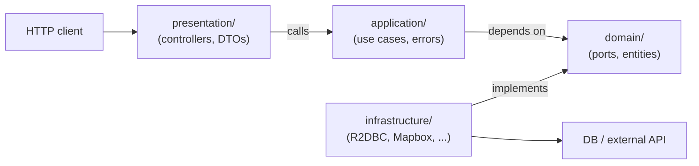

# StayHub Backend (Kotlin + Spring) Skill

## Stack

- Kotlin 2.0+ on JVM 21
- Spring Boot 4.x with **WebFlux + coroutines** (NOT MVC). All controllers use `suspend fun`.
- Spring Data **R2DBC** with `DatabaseClient`. PostgreSQL 16 + PostGIS 3.4. NamedParameter style queries only.
- Flyway migrations under `backend/src/main/resources/db/migration/`.
- Tests: JUnit 5, Kotest assertions, MockK, springmockk, TestContainers, ArchUnit.

## Architecture: Hexagonal / Clean

The codebase follows hexagonal architecture (Ports & Adapters): business logic is independent from frameworks, transport, and persistence. The application core depends on **abstract ports**; **adapters** implement those ports at the edges.

### Core Concepts

- **Domain model** — entities, value objects, business rules. No framework imports. Lives in `domain/`.
- **Use cases** (application layer) — orchestrate domain behaviour and workflow steps. Receive ports via constructor injection.
- **Outbound ports** — interfaces describing dependencies the application needs (repositories, gateways, external services). Live in `domain/<context>/<Name>Repository.kt` (or domain) — NOT in infrastructure.
- **Inbound ports** — interfaces for what the application can do (use case contracts). **NOT used in this codebase yet** — controllers call use case classes directly. This is a pragmatic choice; revisit if controller tests get hard to maintain.
- **Adapters** — concrete implementations at the edges:
  - **Outbound adapters** in `infrastructure/` (R2DBC repositories, Mapbox client, etc.) — implement domain ports.
  - **Inbound adapters** in `presentation/` (REST controllers, DTOs, error mapping) — translate HTTP ↔ application.
- **Composition root** — Spring DI is the de-facto composition root. Beans wired via `@Service`, `@Repository`, and explicit `@Configuration` classes (e.g. `CorsConfig`, `SecurityConfig`).

**Ports model capabilities, not technologies.** A port is named `PropertyRepository`, not `PostgresPropertyRepository`. Adapters carry the technology suffix (e.g. `PropertyRepositoryAdapter`).

### Dependency Direction (always inward)



Enforced by ArchUnit at `backend/src/test/kotlin/com/stayhub/architecture/CleanArchitectureTest.kt`. The build fails if any rule is violated. **If you find yourself wanting to import "the wrong way", move the type DOWN a layer instead of relaxing the rule.**

### Package Layout

| Package | Contents | Notes |
|---|---|---|
| `domain/<context>/` | Entities, value objects, repository interfaces (ports), domain exceptions | Pure Kotlin. NO `org.springframework.*`, NO `jakarta.*`, NO Spring stereotypes. |
| `application/<context>/` | Use cases (`@Service`-annotated). Throw exceptions from `application/error/`. | Depends only on domain. |
| `application/error/` | `ApiException` + subtypes, `ErrorCode`, `ErrorDetail`. Framework-free. | Use cases throw these; presentation maps to HTTP. |
| `infrastructure/persistence/` | `*RepositoryAdapter` (`@Repository`) implementing domain ports via `DatabaseClient` | One adapter per repository port. |
| `infrastructure/<external>/` | External-API adapters (e.g. `geocoding/MapboxGeocodeAdapter`) | Implement domain service ports. |
| `infrastructure/config/` | `@Configuration` classes (CORS, security, JWT, beans) | The composition root, modulo `@Service`/`@Repository` stereotypes. |
| `presentation/api/` | `@RestController` classes — humble: validate, call use case, map response. | `suspend fun` endpoints. |
| `presentation/dto/<context>/` | Request/response DTOs matching the OpenAPI contract | snake_case JSON. |
| `presentation/error/` | `ErrorResponse` (HTTP wire shape), `GlobalExceptionHandler` | Maps application exceptions → HTTP. |
| `presentation/middleware/` | Filters, advice (e.g. `TraceIdFilter`) | |

## How to Add a Use Case (5 steps)

### Step 1: Define the boundary

What's the input? What's the output? Use plain Kotlin types or DTOs that don't leak HTTP/SQL details. Read the relevant `specs/.../contracts/*.yml` for the request/response shape.

### Step 2: List the outbound ports you need

Every side effect is a port. If a repository or external service is missing, define the **interface in `domain/`** first. Name it by capability (`AvailabilityRepository`), not technology (`PostgresAvailabilityRepository`).

```kotlin
// domain/availability/AvailabilityRepository.kt
interface AvailabilityRepository {
    suspend fun findUnavailableDates(propertyId: UUID, from: LocalDate, to: LocalDate): List<UnavailableDate>
}
```

### Step 3: Write the use case (TDD: failing test first)

```kotlin
// application/property/CalculatePriceUseCase.kt
@Service
class CalculatePriceUseCase(
    private val propertyRepository: PropertyRepository,
) {
    suspend fun execute(propertyId: UUID, checkIn: LocalDate, checkOut: LocalDate): PriceBreakdown {
        if (!checkIn.isBefore(checkOut)) throw ValidationException("check_in must be before check_out")
        val property = propertyRepository.findById(propertyId)
            ?: throw NotFoundException("Property not found: $propertyId")
        // ... orchestrate domain rules, return plain data ...
    }
}
```

Validate at the boundary, throw application errors (`application.error.*`), return a domain/data type.

### Step 4: Implement the outbound adapter (if new)

```kotlin
// infrastructure/persistence/AvailabilityRepositoryAdapter.kt
@Repository
class AvailabilityRepositoryAdapter(
    private val databaseClient: DatabaseClient,
) : AvailabilityRepository {
    override suspend fun findUnavailableDates(...): List<UnavailableDate> = databaseClient
        .sql("SELECT date, reason FROM availability WHERE property_id = :id AND date BETWEEN :from AND :to AND is_available = false")
        .bind("id", propertyId).bind("from", from).bind("to", to)
        .map { row, _ -> UnavailableDate(...) }
        .all().collectList().awaitSingle()
}
```

### Step 5: Wire the controller (humble) and the DTOs

```kotlin
@RestController
@RequestMapping("/api/v1/properties")
class PropertyController(private val calculatePrice: CalculatePriceUseCase) {
    @GetMapping("/{id}/price")
    suspend fun price(@PathVariable id: UUID, @RequestParam check_in: String, @RequestParam check_out: String): PriceBreakdownResponse {
        // parse, call use case, map to DTO
    }
}
```

Map the DTO in the controller, NOT in the use case.

## Reference Files (Copy Patterns From These)

| Want to write… | Read this first |
|---|---|
| Use case | `application/property/CalculatePriceUseCase.kt` |
| Use case test | `test/.../application/property/CalculatePriceUseCaseTest.kt` (Kotest + MockK) |
| Repository adapter | `infrastructure/persistence/PropertyRepositoryAdapter.kt` (R2DBC `DatabaseClient`, NamedParameters, JSON column parsing) |
| Domain port | `domain/availability/AvailabilityRepository.kt` (interface, no Spring) |
| Controller | `presentation/api/PropertyController.kt` (`@RestController`, `suspend fun`, `@RequestParam` validation) |
| Controller test | `test/.../presentation/api/PropertyControllerTest.kt` (`@WebFluxTest` + `@MockkBean`) |
| DTO | `presentation/dto/property/PropertyDetailsResponse.kt` (snake_case JSON, `@JsonProperty` where needed) |
| Flyway migration | `resources/db/migration/V*.sql` (incrementing version, descriptive name) |
| ArchUnit guard | `test/.../architecture/CleanArchitectureTest.kt` |

## Project Conventions

- **Package root:** `com.stayhub.<layer>.<bounded-context>` (e.g. `com.stayhub.application.property`).
- **JSON contract:** snake_case in JSON. Kotlin field can stay camelCase; Jackson converts automatically — EXCEPT for the cases below.
- **Booleans starting with `is`** (e.g. `is_verified`): Jackson strips the `is` prefix and renders as `_verified`. Annotate with `@get:JsonProperty("is_verified")` to fix. (Phase 4 bug.)
- **Pricing / money:** All Doubles representing money MUST be rounded to 2 decimals before serializing. Use a local `round2(value: Double): Double = Math.round(value * 100.0) / 100.0` helper. Storage is `DECIMAL(10,2)`. (Phase 4 bug: `34.199999...`)
- **Validation/errors:** Throw `application.error.ValidationException` (HTTP 400) or `application.error.NotFoundException` (HTTP 404) from use cases. `GlobalExceptionHandler` maps to error response.
- **`ErrorCode`** is a pure enum in `application/error/`. The HTTP status mapping lives in `GlobalExceptionHandler` only.

## Spring / Framework Pitfalls (Phase 3+4 evidence)

| Mistake | Symptom | Rule |
|---|---|---|
| Forgot `@Service` on a use case | `UnsatisfiedDependencyException` at boot | All use cases need `@Service`; all repository adapters need `@Repository` |
| Used `@ConditionalOnBean` for ordering | Bean missing at startup | Don't use it. Just declare beans unconditionally. |
| `is_verified` in DTO | Jackson serialized as `_verified` | Add `@get:JsonProperty("is_verified")` |
| Money in `Double` no rounding | `34.199999...` in API response | Round to 2 decimals before returning |
| PostGIS `ST_Contains(geog, geog)` | `function st_contains(geography, geography) does not exist` | Cast `location::geometry` (column is `geography`); the envelope stays `geometry` |
| String interpolation in SQL | SQL injection / type errors | Always use NamedParameter (`:name`) bindings |
| Importing `presentation.*` from `application/` | ArchUnit fails build | Move the type to `application/error/` or `domain/`; never the other way |

## Testing Per Boundary

| Layer | Test type | Example | Mocks? |
|---|---|---|---|
| **Domain** | Pure unit test | Entity invariants, value object equality | None — pure business rules |
| **Application** (use case) | Unit test with fake ports | `CalculatePriceUseCaseTest`: mock the repository, assert validation + orchestration | MockK fakes for ports |
| **Outbound adapter** | Integration test against real DB | `AvailabilityRepositoryAdapterTest` with TestContainers PostgreSQL | None for the SUT — real R2DBC + real Postgres |
| **Inbound adapter** (controller) | `@WebFluxTest` slice | `PropertyControllerTest` with `@MockkBean` use cases | Mocked use case |
| **End-to-end** | Full `@SpringBootTest` + TestContainers | Full app boot, hit the endpoint with WebTestClient | Optionally mock external HTTP (Mapbox) via WireMock |

**Mocks-only unit tests miss SQL bugs, wiring bugs, and serialization bugs** (we paid for this in Phase 3+4 — see `WAVE4-PHASE3-LEARNINGS.md`). Always include at least one integration test that boots Spring + DB for any new use case.

## TDD Cycle (Mandatory)

1. RED: Write a failing test (use case test, controller test, or adapter integration test).
2. GREEN: Make it pass with the minimum implementation.
3. REFACTOR: With tests as safety net.
4. Commit. Tests must pass before push.

`./gradlew test` (clean: `./gradlew clean test`). Single test class: `./gradlew test --tests "com.stayhub.application.property.CalculatePriceUseCaseTest"`.

## Validation Before Marking Task Done

```bash
cd backend
./gradlew clean test          # all tests pass — INCLUDING ArchUnit
./gradlew bootRun &            # app actually starts (catches wiring/config bugs unit tests miss)
sleep 30
curl http://localhost:8080/actuator/health   # {"status":"UP"}
# curl your new endpoint with a real seeded UUID, confirm 200 and contract shape
pkill -f bootRun
```

If the app fails to boot or curl returns 500 / wrong shape, the task is NOT done — even if `./gradlew test` is green.

## Seeded Data (for manual curl)

- Hosts in `host` table: UUIDs `aaaaaaaa-aaaa-aaaa-aaaa-00000000000{N}` for N=1..3.
- Properties in `property` table: `cccccccc-cccc-cccc-cccc-00000000{Type}{N:03d}` — Barcelona = 1001..1005, Madrid = 2001..2004, Lisbon = 3001..3005.
- 15 properties total, 0 reviews, 0 bookings (Phase 5 will seed bookings).

## Domain Aggregate Checklist (lessons from T049)

When writing a domain aggregate, verify all three of these before committing:

### 1. Derived-but-stored fields must be cross-validated in `init {}`

If a field is computed from other fields but also stored as a column (e.g. `nights` derived from `checkIn`/`checkOut`), the `init {}` block must assert consistency:

```kotlin
// Booking.kt — nights is stored in DB but derivable from dates
init {
    require(nights == ChronoUnit.DAYS.between(checkIn, checkOut).toInt()) {
        "nights ($nights) does not match checkOut - checkIn"
    }
}
```

Without this guard, a caller can silently persist `nights = 99` for a two-night booking. The DB stores wrong data; no error is thrown until you manually notice the inconsistency.

**Rule:** any redundant column that can be recomputed from sibling fields must be validated for consistency at construction time.

### 2. Check the Flyway migration's CHECK constraint when adding a new status value

When a domain `enum` has a value that did not exist in the original schema (e.g. `PENDING` was added to `BookingStatus` but the V5 migration only listed `'confirmed'`, `'cancelled'`, `'completed'`), every insert of the new status fails at runtime with a CHECK constraint violation.

**Rule:** after defining or extending a status enum, grep the Flyway migrations for the relevant `CHECK (status IN (...))` clause and verify it includes **every** enum value:

```bash
grep -r "status IN" backend/src/main/resources/db/migration/
```

If a value is missing, create a new migration to extend the constraint — never edit an already-run migration.

### 3. Nullable domain field vs NOT NULL DB column

If a DB column is `NOT NULL`, the domain field should be non-nullable (`String`, not `String?`). A nullable domain field with a `NOT NULL` column will fail at insert time, not at compile time.

**Rule:** map DB nullability to Kotlin nullability 1-for-1. Before merging a new aggregate, compare each field against its column definition in the Flyway migration:

| DB column | Kotlin type |
|---|---|
| `VARCHAR NOT NULL` | `String` |
| `VARCHAR` (nullable) | `String?` |
| `TIMESTAMP NOT NULL` | `Instant` |
| `TIMESTAMP` | `Instant?` |

---

## Anti-Patterns to Avoid

- **Domain entities importing ORM, web, or SDK types** — domain stays framework-free.
- **Use cases reading from `req`, `ServerWebExchange`, or any HTTP type** — that's the controller's job.
- **Returning database rows or R2DBC `Row` directly from use cases** — map in the adapter.
- **Adapters calling other adapters directly** — flow through use-case ports.
- **Spreading wiring across many `@Configuration` classes with hidden coupling** — keep `@Configuration` focused (one concern per class).
- **String interpolation in SQL** — always NamedParameter.
- **Tests that only mock the DB** — always include at least one integration test boot for any new repository.

## Best Practices Checklist

- [ ] Domain and application layers import only internal types and ports (no Spring, no Jakarta, no SDKs).
- [ ] Every external dependency has an outbound port interface in `domain/`.
- [ ] Validation occurs at boundaries (controller `@RequestParam` checks + use case invariants).
- [ ] Use cases return plain data (domain types or DTOs), never `Row` or driver-specific types.
- [ ] Errors are translated across boundaries (infra exceptions caught/wrapped → application errors → HTTP).
- [ ] `@Service`, `@Repository`, `@RestController` all present on the right layers.
- [ ] Composition is explicit (`@Configuration` classes are easy to audit; no service-locator gymnastics).
- [ ] At least one integration test (TestContainers) per new repository.
- [ ] Application boots cleanly: `./gradlew bootRun` then `curl /actuator/health` returns UP.
- [ ] ArchUnit tests pass (no layering violations).

## Common Mistakes — Self-Check Before Commit

- ❌ Use case throws `presentation.error.ValidationException` → use `application.error.ValidationException`
- ❌ Domain interface imports `org.springframework.*` → keep domain framework-free (Page/Pageable from Spring Data is the one accepted leak as of June 2026)
- ❌ Controller does business logic → move to use case; controller stays humble
- ❌ Repository adapter uses string concat for SQL → NamedParameter only
- ❌ `bootRun` not actually tested → run it before reporting done
- ❌ Test passes with mocked DB → for repository changes, write integration test with TestContainers
- ❌ Response field misnamed (e.g. `_verified` instead of `is_verified`) → check OpenAPI contract before merging
- ❌ New status value in domain enum not added to Flyway CHECK constraint → `grep -r "status IN" db/migration/` and add a new migration if missing (T049 bug)
- ❌ Derived-but-stored field (e.g. `nights`) not validated in `init {}` → silently persists wrong data (T049 bug)
- ❌ Domain field nullable but DB column is NOT NULL → insert fails at runtime not compile time (T049 bug)
