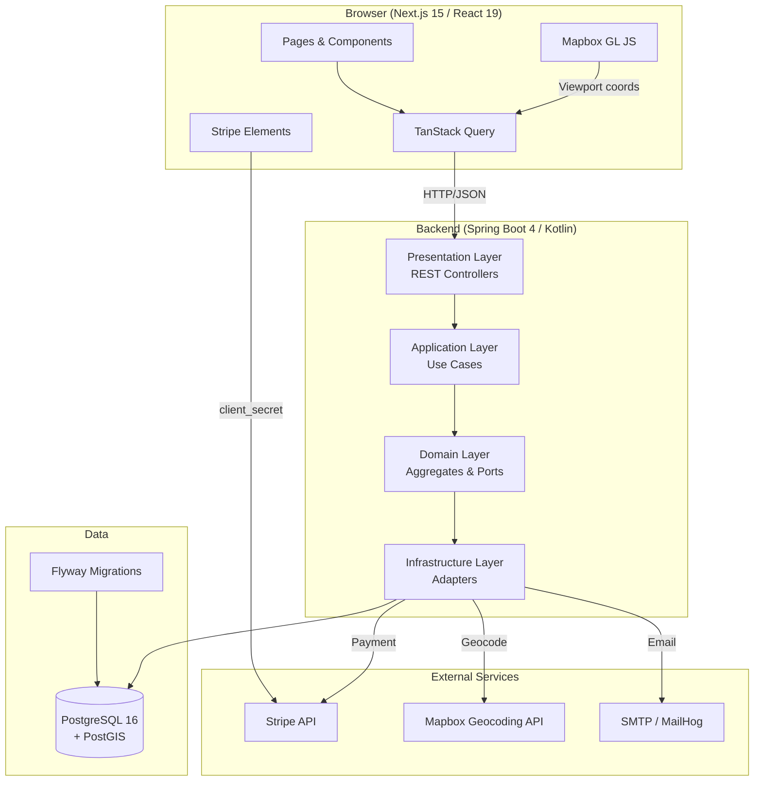
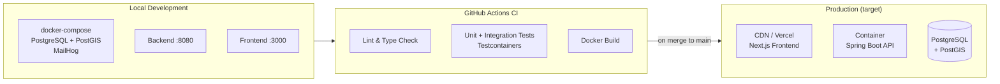
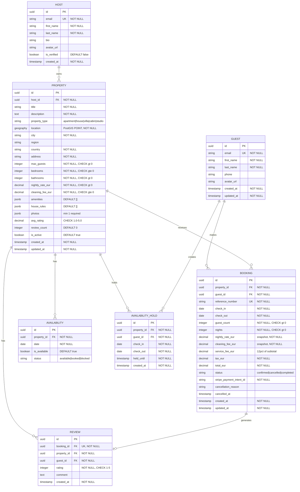

## Index

0. [Project Card](#0-project-card)
1. [General Product Description](#1-general-product-description)
2. [System Architecture](#2-system-architecture)
3. [Data Model](#3-data-model)
4. [API Specification](#4-api-specification)
5. [User Stories](#5-user-stories)
6. [Work Tickets](#6-work-tickets)
7. [Pull Requests](#7-pull-requests)

---

## 0. Project Card

### **0.1. Full name:**

Jordi Gil Llorca

### **0.2. Project name:**

StayHub

### **0.3. Brief project description:**

StayHub is an AI-assisted implementation of a modern vacation rental marketplace inspired by platforms like Airbnb. The platform allows hosts to publish and manage rental properties while guests can search, filter, book, and review accommodations through a clean and intuitive experience. The project is built using specification-first engineering workflows with Claude Code and Spec Kit, emphasizing production-quality architecture, domain-driven design, and AI-native development practices.

### **0.4. Project URL:**

_To be added after deployment._

### **0.5. Repository URL**

[https://github.com/jordi-gil-n26/AI4Devs-finalproject-JGLL](https://github.com/jordi-gil-n26/AI4Devs-finalproject-JGLL)

---

## 1. General Product Description

### **1.1. Objective:**

StayHub solves the challenge of finding and booking short-term vacation rentals by providing a marketplace where guests can discover properties through an interactive map, check real-time availability, and complete instant bookings with secure payment — all in a single seamless flow.

**Value delivered:**
- **For guests**: Find and book accommodations quickly with map-based search, transparent pricing, and immediate booking confirmation.
- **For hosts**: Reach guests with a listing that showcases photos, amenities, and availability with no friction.
- **For the project**: Serves as a real-world case study in AI-assisted, specification-driven software engineering.

### **1.2. Main features and functionalities:**

| Feature | Description |
|---------|-------------|
| **Map-based property search** | Guests search by location and dates using an interactive map viewport. Results update dynamically as the map is panned or zoomed. |
| **Advanced filtering** | Filter by price range, number of guests, property type (apartment, house, villa, cabin, studio), bedrooms, and amenities. |
| **Property detail page** | Full listing view with photo gallery, description, amenities, house rules, availability calendar, price breakdown, host profile, and guest reviews. |
| **Instant booking** | Guests reserve directly without host approval. A 10-minute availability hold is placed during checkout to prevent double-booking. |
| **Stripe payment integration** | Secure card payments via Stripe Payment Intents and Stripe Elements. Full PCI compliance via client-side tokenization. |
| **Booking management** | Guests can view upcoming and past trips, access booking details (address, host contact), and cancel eligible bookings per the platform cancellation policy. |
| **Cancellation policy** | Full refund if cancelled 48+ hours before check-in. No refund within 48 hours. |
| **Email notifications** | Automatic booking confirmation and cancellation emails sent to both guest and host. |

### **1.3. Design and user experience:**

The guest experience follows a linear, low-friction flow:

1. **Search** — Guest enters a destination and dates. An interactive map renders matching properties as markers; a results list shows alongside.
2. **Filter** — Optional filters narrow results by price, type, guests, and amenities.
3. **Property detail** — Guest selects a property and views the full listing, availability calendar, and live price breakdown.
4. **Checkout** — Guest clicks Reserve, reviews the price summary, and enters card details via Stripe Elements.
5. **Confirmation** — Instant confirmation page with booking reference number.
6. **My Trips** — Guest can revisit all bookings, view details, and cancel if eligible.

_Screenshots and demo video to be added after initial implementation._

### **1.4. Installation instructions:**

#### Prerequisites

- Docker + Docker Compose
- JDK 21+
- Node.js 20+ and pnpm
- Stripe CLI (for webhook testing)

#### 1. Clone the repository

```bash
git clone https://github.com/jordi-gil-n26/AI4Devs-finalproject-JGLL.git
cd AI4Devs-finalproject-JGLL
```

#### 2. Configure environment variables

Create `backend/.env`. The file is loaded automatically by Spring via
`spring.config.import=optional:file:./.env[.properties]`, so it must use
plain Java properties syntax: `KEY=VALUE` lines only — no `export`, no
quoted values, no shell interpolation.

```env
POSTGRES_HOST=localhost
POSTGRES_PORT=5432
POSTGRES_DB=stayhub
POSTGRES_USER=stayhub
POSTGRES_PASSWORD=stayhub_dev

STRIPE_API_KEY=sk_test_dummy
STRIPE_WEBHOOK_SECRET=whsec_test_dummy

MAPBOX_API_KEY=pk_test_...

MAIL_HOST=localhost
MAIL_PORT=1025
MAIL_FROM=noreply@stayhub.local

# 32+ character secret. Generate with: openssl rand -base64 48
JWT_SECRET=replace_me_with_a_32_plus_character_local_dev_secret
JWT_ISSUER=stayhub
```

The Spring context refuses to start if `JWT_SECRET` is unset or shorter
than 32 characters — boot fails fast with a clear binding error rather
than 500-ing on the first `/api/v1/auth/*` request.

See `specs/001-guest-search-booking/quickstart.md` for the full
developer setup walkthrough.

Create `frontend/.env.local`:

```env
NEXT_PUBLIC_API_URL=http://localhost:8080
NEXT_PUBLIC_MAPBOX_TOKEN=pk.test_...
NEXT_PUBLIC_STRIPE_PUBLISHABLE_KEY=pk_test_...
```

#### 3. Start the infrastructure

```bash
docker compose up -d
# Starts: PostgreSQL 16 + PostGIS, MailHog (fake SMTP)
```

#### 4. Start the backend

```bash
cd backend
./gradlew bootRun
# Flyway migrations run automatically on startup
```

#### 5. Start the frontend

```bash
cd frontend
pnpm install
pnpm dev
```

#### 6. (Optional) Forward Stripe webhooks

```bash
stripe listen --forward-to localhost:8080/api/v1/webhooks/stripe
```

#### Access points

| Service | URL |
|---------|-----|
| Frontend | http://localhost:3000 |
| Backend API | http://localhost:8080 |
| Swagger UI | http://localhost:8080/swagger-ui.html |
| Email viewer (MailHog) | http://localhost:8025 |

---

## 2. System Architecture

### **2.1. Architecture diagram:**



**Architecture pattern**: Clean Architecture with strict inward dependency rules — presentation depends on application, application depends on domain, infrastructure implements domain ports. This ensures the domain layer is framework-free and independently testable.

**Why this architecture?**
- Domain isolation means business rules (booking lifecycle, pricing, availability holds) are testable without spinning up Spring or a database.
- Port/adapter pattern allows swapping Stripe for another payment provider or Mapbox for another geocoder without touching business logic.
- Reactive stack (WebFlux + R2DBC + coroutines) handles concurrent search requests efficiently without blocking threads.

**Trade-offs:**
- R2DBC has a smaller ecosystem than JDBC (no PostGIS native type support; manual SQL for spatial queries).
- More boilerplate than a simple monolith — justified by the domain complexity of a marketplace.

### **2.2. Main components:**

| Component | Technology | Responsibility |
|-----------|-----------|----------------|
| **Frontend SPA** | Next.js 15, React 19, TypeScript | Renders all guest-facing pages; communicates with backend via REST |
| **Interactive Map** | Mapbox GL JS via react-map-gl | Displays property markers; fires viewport-change events to trigger new searches |
| **Payment UI** | Stripe Elements | Collects card details client-side; never sends raw card data to our servers |
| **Server State** | TanStack Query | Caches API responses, handles refetching on viewport change, manages loading/error states |
| **REST API** | Spring Boot 4, Spring WebFlux | Exposes all backend functionality; handles auth, validation, and routing |
| **Use Cases** | Kotlin coroutines | Orchestrates domain logic: search, create booking, confirm payment, cancel booking |
| **Domain Model** | Pure Kotlin | Aggregates (Booking, Property), value objects (Money, DateRange), port interfaces |
| **Persistence** | Spring Data R2DBC + PostgreSQL | Non-blocking database access; PostGIS bounding-box queries for geospatial search |
| **Payment Adapter** | Stripe SDK (Kotlin) | Creates PaymentIntents, verifies webhook signatures, processes refunds |
| **Email Adapter** | Spring Mail + Thymeleaf | Sends booking confirmation and cancellation notifications |
| **Geocoding Adapter** | Mapbox Geocoding API | Converts city names to coordinates for initial map centering |

### **2.3. High-level project structure**

```text
/
├── backend/                        # Spring Boot 4 / Kotlin service
│   ├── build.gradle.kts            # Gradle Kotlin DSL build file
│   ├── Dockerfile
│   └── src/main/kotlin/com/stayhub/
│       ├── domain/                 # Pure business logic (no framework)
│       │   ├── property/           # Property aggregate (read model for search)
│       │   ├── booking/            # Booking aggregate, PaymentService port
│       │   ├── availability/       # AvailabilityHold, port interfaces
│       │   └── shared/             # Money, DateRange value objects
│       ├── application/            # Use cases orchestrating domain objects
│       │   ├── search/             # SearchPropertiesUseCase
│       │   ├── property/           # GetPropertyDetailsUseCase, CalculatePriceUseCase
│       │   └── booking/            # CreateBookingUseCase, ConfirmBookingUseCase,
│       │                           # CancelBookingUseCase, GetMyTripsUseCase
│       ├── infrastructure/         # Adapter implementations
│       │   ├── persistence/        # R2DBC repository adapters + hold cleanup scheduler
│       │   ├── payment/            # Stripe adapter
│       │   ├── email/              # SMTP adapter + Thymeleaf templates
│       │   ├── geocoding/          # Mapbox geocoding adapter
│       │   └── config/             # Spring Security, R2DBC, Flyway config
│       └── presentation/           # HTTP layer
│           ├── api/                # SearchController, PropertyController, BookingController
│           ├── dto/                # Request/Response data classes
│           └── middleware/         # JWT filter, trace ID filter, global error handler
│
├── frontend/                       # Next.js 15 / TypeScript app
│   ├── next.config.ts
│   ├── Dockerfile
│   └── src/
│       ├── app/                    # Next.js App Router pages
│       │   ├── search/             # Map search page (P1 MVP)
│       │   ├── property/[id]/      # Property detail page
│       │   ├── booking/[id]/       # Checkout page
│       │   ├── confirmation/[id]/  # Booking confirmation
│       │   └── trips/              # My Trips + trip detail
│       ├── components/             # Feature-organized UI components
│       │   ├── search/             # SearchBar, FilterPanel, PropertyCard, MapView
│       │   ├── property/           # PhotoGallery, AvailabilityCalendar, PriceBreakdown
│       │   ├── booking/            # BookingSummary, PaymentForm, TripCard
│       │   └── shared/             # NavigationBar, LoadingSkeletons, ErrorBoundary
│       ├── services/               # API client functions + TanStack Query hooks
│       ├── types/                  # TypeScript interfaces matching API contracts
│       └── lib/                    # Formatting utilities, validation helpers
│
├── specs/001-guest-search-booking/ # Specification-first design artifacts
│   ├── spec.md                     # Feature specification
│   ├── plan.md                     # Implementation plan
│   ├── data-model.md               # Entity model + ERD
│   ├── research.md                 # Technology decisions and rationale
│   ├── quickstart.md               # Developer setup guide
│   ├── tasks.md                    # Ordered implementation task list
│   └── contracts/                  # OpenAPI 3.1 contracts (search, property, booking)
│
├── docker-compose.yml              # PostgreSQL + PostGIS + MailHog
└── .github/
    └── pull_request_template.md    # Enforced PR structure
```

### **2.4. Infrastructure and deployment**



**Local**: Everything runs via Docker Compose. Flyway migrations apply automatically on backend startup. No manual setup beyond environment variables.

**CI**: GitHub Actions runs lint, type checks, and tests (Testcontainers spins up a real PostgreSQL + PostGIS instance for integration tests) on every push and PR.

**Production target**: Frontend deployed to Vercel (or similar CDN-backed platform). Backend and database containerized and deployed to a cloud provider. Secrets managed via environment variables — never committed to source control.

### **2.5. Security**

| Practice | Implementation |
|----------|---------------|
| **Authentication** | JWT tokens validated on every authenticated request via a Spring Security filter chain |
| **Authorization** | Enforced at the use-case layer — guests can only access their own bookings (not just at the controller) |
| **Input validation** | All API inputs validated at the presentation layer before reaching use cases; errors return structured `ErrorResponse` with field-level details |
| **PCI compliance** | Card data never touches our servers — Stripe Elements tokenizes on the client; we only receive a `payment_intent_id` |
| **Webhook security** | Stripe webhook signature verified using `STRIPE_WEBHOOK_SECRET` before processing any payment events |
| **Secrets management** | All credentials in environment variables; `.env` files excluded from version control via `.gitignore` |
| **Structured logging** | No PII (card numbers, emails) written to logs; trace IDs enable request correlation without exposing sensitive data |
| **OWASP Top 10** | SQL injection prevented by parameterized R2DBC queries; XSS mitigated by React's default escaping; CSRF not applicable (JWT stateless API) |

### **2.6. Tests**

The testing strategy covers four layers aligned with the constitution's Testing Discipline principle:

| Layer | Tool | Scope |
|-------|------|-------|
| **Unit** | JUnit 5 + Kotest + MockK | Domain aggregates (Booking state transitions, pricing formula), use case logic with mocked ports |
| **Integration** | Testcontainers + Spring WebTestClient | Repository adapters against a real PostgreSQL + PostGIS instance; Stripe adapter with WireMock |
| **Contract** | Spring WebTestClient | API endpoint compliance against OpenAPI contracts in `specs/contracts/` |
| **E2E** | Playwright | Critical user journeys: search → detail → checkout → confirmation; trip cancellation flow |

**Example unit test — pricing formula:**
```kotlin
@Test
fun `calculates total with 12% service fee and zero tax`() {
    val price = PriceCalculator.calculate(
        nightlyRate = Money(100.EUR),
        nights = 3,
        cleaningFee = Money(30.EUR)
    )
    assertThat(price.subtotal).isEqualTo(Money(300.EUR))
    assertThat(price.serviceFee).isEqualTo(Money(36.EUR))  // 12% of 300
    assertThat(price.total).isEqualTo(Money(366.EUR))
}
```

**Example integration test — availability hold:**
```kotlin
@Test
fun `places 10-minute hold and prevents concurrent booking`() {
    // Given a property with available dates
    val hold = availabilityHoldRepository.createHold(propertyId, checkIn, checkOut, guestId)
    assertThat(hold.heldUntil).isAfter(Instant.now().plus(9, MINUTES))

    // When another guest queries the same dates
    val available = availabilityRepository.isAvailable(propertyId, checkIn, checkOut)
    assertThat(available).isFalse()
}
```

---

## 3. Data Model

### **3.1. Data model diagram:**



### **3.2. Description of main entities:**

**GUEST**
Represents a registered user who searches and books properties. Read-only for this feature — writes handled by the authentication bounded context. Key fields: `email` (unique), `first_name`, `last_name`. No FK dependencies within this feature.

**HOST**
Represents a property owner. Also a read model in this context. Notable field: `is_verified` flag shown on property listings to build guest trust.

**PROPERTY**
The central search entity. The `location` column uses PostgreSQL's PostGIS `geography` type (POINT), enabling spatial indexing via GiST for sub-second bounding-box queries. `photos`, `amenities`, and `house_rules` are stored as JSONB arrays. `avg_rating` and `review_count` are denormalized for fast search result rendering.

**AVAILABILITY**
Sparse table tracking date-level availability per property. One row per blocked/booked date — absence of a row means the date is available. Unique constraint on `(property_id, date)`.

**AVAILABILITY\_HOLD**
Temporary lock created when a guest initiates checkout. `held_until` is set to `NOW() + 10 minutes`. A scheduled cleanup job deletes expired rows every 5 minutes. Availability queries exclude dates covered by active holds.

**BOOKING**
The core transactional aggregate. Prices (`nightly_rate_eur`, `cleaning_fee_eur`, `service_fee_eur`) are snapshotted at creation time — the booking record always reflects the exact price the guest agreed to, regardless of subsequent host pricing changes. Lifecycle: `confirmed → cancelled` (guest cancels) or `confirmed → completed` (check-out date passes). No pending state — booking is instant upon payment success.

**REVIEW**
One review per booking (enforced by unique constraint on `booking_id`). Only creatable after booking status is `completed`. Stores first name only in query results to protect guest privacy.

---

## 4. API Specification

The full OpenAPI 3.1 contracts are in `specs/001-guest-search-booking/contracts/`. Below are the three primary endpoints.

### Endpoint 1 — Search Properties

```yaml
GET /api/v1/properties/search

Parameters:
  sw_lat, sw_lng, ne_lat, ne_lng  # Map viewport bounding box (required)
  check_in, check_out             # Date range in YYYY-MM-DD (required)
  guests                          # Number of guests (default: 1)
  min_price, max_price            # EUR nightly rate filter
  property_type                   # apartment | house | villa | cabin | studio
  bedrooms                        # Minimum bedrooms
  amenities[]                     # Required amenities (all must match)
  sort                            # relevance | price_asc | price_desc | rating
  page, size                      # Pagination (default: page=1, size=20)
```

**Example request:**
```
GET /api/v1/properties/search?sw_lat=41.3&sw_lng=2.1&ne_lat=41.5&ne_lng=2.3
  &check_in=2025-07-01&check_out=2025-07-07&guests=2&sort=price_asc
```

**Example response:**
```json
{
  "results": [
    {
      "id": "a1b2c3d4-...",
      "title": "Sunny apartment near Sagrada Família",
      "photo_url": "https://cdn.stayhub.com/photos/a1b2c3d4/main.jpg",
      "nightly_rate_eur": 85.00,
      "cleaning_fee_eur": 25.00,
      "location": { "lat": 41.403, "lng": 2.174, "city": "Barcelona", "country": "Spain" },
      "avg_rating": 4.8,
      "review_count": 42,
      "property_type": "apartment",
      "max_guests": 4,
      "bedrooms": 2
    }
  ],
  "pagination": { "page": 1, "size": 20, "total_results": 34, "total_pages": 2 }
}
```

---

### Endpoint 2 — Create Booking (Initiate Payment)

```yaml
POST /api/v1/bookings
Authorization: Bearer <JWT>

Body:
  property_id   # UUID (required)
  check_in      # YYYY-MM-DD (required)
  check_out     # YYYY-MM-DD (required)
  guest_count   # integer >= 1 (required)
```

**Example request:**
```json
{
  "property_id": "a1b2c3d4-e5f6-...",
  "check_in": "2025-07-01",
  "check_out": "2025-07-07",
  "guest_count": 2
}
```

**Example response (201 Created):**
```json
{
  "booking_id": "b9c8d7e6-...",
  "reference_number": "BK-20250517-X7K2M1",
  "price_breakdown": {
    "nights": 6,
    "nightly_rate_eur": 85.00,
    "subtotal_eur": 510.00,
    "cleaning_fee_eur": 25.00,
    "service_fee_eur": 61.20,
    "tax_eur": 0.00,
    "total_eur": 596.20
  },
  "stripe_client_secret": "pi_3abc...secret_xyz",
  "hold_expires_at": "2025-05-17T14:25:00Z"
}
```

---

### Endpoint 3 — Get Property Details

```yaml
GET /api/v1/properties/{propertyId}
```

**Example response (200 OK):**
```json
{
  "id": "a1b2c3d4-...",
  "title": "Sunny apartment near Sagrada Família",
  "description": "A bright 2-bedroom apartment...",
  "property_type": "apartment",
  "location": {
    "lat": 41.403, "lng": 2.174,
    "city": "Barcelona", "country": "Spain",
    "address": "Visible after booking"
  },
  "max_guests": 4,
  "bedrooms": 2,
  "bathrooms": 1,
  "nightly_rate_eur": 85.00,
  "cleaning_fee_eur": 25.00,
  "amenities": ["wifi", "air_conditioning", "kitchen", "washing_machine"],
  "house_rules": ["No smoking", "No pets", "Check-in after 15:00"],
  "photos": [
    { "url": "https://cdn.stayhub.com/photos/a1b2c3d4/1.jpg", "caption": "Living room" }
  ],
  "host": {
    "id": "h1i2j3k4-...",
    "first_name": "Maria",
    "avatar_url": "https://cdn.stayhub.com/avatars/h1i2j3k4.jpg",
    "is_verified": true
  },
  "avg_rating": 4.8,
  "review_count": 42
}
```

---

## 5. User Stories

### User Story 1 — Search Properties by Location and Dates (P1 · MVP)

> As a guest, I want to search for available properties by entering a destination and travel dates so I can find suitable accommodations for my trip.

**Acceptance criteria:**
1. **Given** a guest on the search page, **When** they enter a city and check-in/check-out dates, **Then** the system displays available properties for those dates on a map and in a results list.
2. **Given** search results are displayed, **When** the guest applies filters (price, guests, amenities), **Then** results update to show only matching properties.
3. **Given** no matching results, **When** the page renders, **Then** an empty state is shown with suggestions to broaden the search.
4. **Given** a large result set, **When** the guest scrolls, **Then** results are paginated (20 per page) without blocking the UI.

**Definition of Done:** Guest can find a relevant property within 3 search attempts for 90% of common destinations. Search results load in under 1 second (p95).

---

### User Story 2 — Complete a Booking (P3 · Core Transaction)

> As a guest, I want to book a property for my selected dates so I can secure my accommodation and receive a confirmation.

**Acceptance criteria:**
1. **Given** a guest on a property detail page with dates selected, **When** they click "Reserve", **Then** they see a checkout page with the full price breakdown and a Stripe payment form.
2. **Given** a guest on the checkout page, **When** they enter valid card details and confirm, **Then** the system creates a confirmed booking and displays a confirmation with a reference number.
3. **Given** two guests attempting the same dates simultaneously, **When** the first enters checkout, **Then** a 10-minute hold is placed on those dates — the second guest cannot book until the hold expires.
4. **Given** a successful payment, **When** the transaction completes, **Then** both guest and host receive email notifications.

**Definition of Done:** End-to-end booking flow completes in under 5 minutes. Double-booking rate is 0%.

---

### User Story 3 — Manage Bookings (P4 · Post-Booking)

> As a guest, I want to view my upcoming and past bookings so I can manage my travel plans and access booking details.

**Acceptance criteria:**
1. **Given** a logged-in guest, **When** they navigate to "My Trips", **Then** they see all bookings with property name, dates, status, and total cost.
2. **Given** a guest viewing an upcoming booking, **When** they select it, **Then** they see full details including property address, check-in instructions, and host contact.
3. **Given** a guest with a booking outside the 48-hour cancellation window, **When** they cancel, **Then** the system displays the refund amount and processes a full refund via Stripe.

**Definition of Done:** Booking list loads correctly for all statuses; cancellation correctly applies the platform policy and triggers a Stripe refund.

---

## 6. Work Tickets

### Ticket 1 — Backend: Implement CreateBookingUseCase with Availability Hold

**Type:** Backend  
**Task ID:** T054  
**User Story:** US3 — Complete a Booking

**Description:**  
Implement the `CreateBookingUseCase` in `backend/src/main/kotlin/com/stayhub/application/booking/CreateBookingUseCase.kt`.

This use case is the entry point for the booking flow. It must:

1. Validate requested dates (check-in in the future, check-out after check-in)
2. Verify the property exists and is active
3. Check no active availability hold or confirmed booking exists for the requested dates
4. Create a 10-minute `AvailabilityHold` row via `AvailabilityHoldRepository`
5. Calculate the full price snapshot (nightly rate × nights + cleaning fee + 12% service fee)
6. Create a Stripe `PaymentIntent` via `PaymentService` port for the total amount in EUR
7. Persist a booking draft and return the Stripe `client_secret` + `hold_expires_at`

**Acceptance criteria:**
- Returns `CreateBookingResponse` with `booking_id`, `reference_number`, `price_breakdown`, `stripe_client_secret`, and `hold_expires_at`
- Returns `409 DATES_UNAVAILABLE` if dates are held or booked
- Returns `400 VALIDATION_ERROR` if dates are in the past or check-out ≤ check-in
- Hold row has `held_until = NOW() + 10 minutes`
- Price breakdown matches the formula: `subtotal = nightly_rate × nights`, `service_fee = subtotal × 0.12`

**Files to create/modify:**
- `backend/src/main/kotlin/com/stayhub/application/booking/CreateBookingUseCase.kt` (create)
- `backend/src/main/kotlin/com/stayhub/infrastructure/persistence/AvailabilityHoldRepositoryAdapter.kt` (create)

---

### Ticket 2 — Frontend: Implement MapView Component with Viewport-Triggered Search

**Type:** Frontend  
**Task ID:** T033  
**User Story:** US1 — Search Properties by Location and Dates

**Description:**  
Implement the `MapView` component in `frontend/src/components/search/MapView.tsx`.

This is the interactive map that sits alongside the results list on the search page. It must:

1. Render a Mapbox GL map via `react-map-gl` centered on the geocoded location
2. Display a marker for each property in the results list
3. Fire an `onViewportChange(bounds: BoundingBox)` callback whenever the user pans or zooms, triggering a new search query with the new bounding box
4. Highlight the marker corresponding to a hovered property card in the results list (and vice versa)
5. On marker click, navigate to the property detail page

**Acceptance criteria:**
- Map renders with correct initial center and zoom based on geocoded location
- Panning the map triggers `onViewportChange` with updated `sw_lat/sw_lng/ne_lat/ne_lng`
- Marker count matches the results list count
- Hovered marker changes to an active style
- Clicking a marker navigates to `/property/{id}`

**Files to create/modify:**
- `frontend/src/components/search/MapView.tsx` (create)
- `frontend/src/app/search/page.tsx` (update — wire `onViewportChange` to re-trigger search query)

---

### Ticket 3 — Database: Create Availability and Availability Hold Schema

**Type:** Database  
**Task ID:** T011  
**User Story:** Foundational (blocks all booking user stories)

**Description:**  
Create Flyway migration `V4__create_availability.sql` in `backend/src/main/resources/db/migration/`.

This migration creates two tables that power the real-time availability system:

**`availability` table** — sparse date-level availability per property:
```sql
CREATE TABLE availability (
    id UUID PRIMARY KEY DEFAULT uuid_generate_v4(),
    property_id UUID NOT NULL REFERENCES property(id) ON DELETE CASCADE,
    date DATE NOT NULL,
    is_available BOOLEAN NOT NULL DEFAULT true,
    status VARCHAR(20) NOT NULL DEFAULT 'available'
        CHECK (status IN ('available', 'booked', 'blocked')),
    CONSTRAINT uq_availability_property_date UNIQUE (property_id, date)
);
CREATE INDEX idx_availability_available ON availability (property_id, date)
    WHERE is_available = true;
```

**`availability_hold` table** — temporary holds during checkout:
```sql
CREATE TABLE availability_hold (
    id UUID PRIMARY KEY DEFAULT uuid_generate_v4(),
    property_id UUID NOT NULL REFERENCES property(id) ON DELETE CASCADE,
    guest_id UUID NOT NULL REFERENCES guest(id) ON DELETE CASCADE,
    check_in DATE NOT NULL,
    check_out DATE NOT NULL,
    held_until TIMESTAMP WITH TIME ZONE NOT NULL,
    created_at TIMESTAMP WITH TIME ZONE NOT NULL DEFAULT NOW()
);
CREATE INDEX idx_hold_property_dates ON availability_hold (property_id, check_in, check_out);
CREATE INDEX idx_hold_expiry ON availability_hold (held_until);
```

**Acceptance criteria:**
- Migration applies cleanly on a fresh database after V1–V3
- Unique constraint on `(property_id, date)` prevents duplicate availability rows
- Indexes are created as specified
- `availability_hold.held_until` index enables efficient cleanup queries

**Files to create:**
- `backend/src/main/resources/db/migration/V4__create_availability.sql`

---

## 7. Pull Requests

### Pull Request 1 — [Spec Kit] Add project constitution and guest search & booking specification

**What:** Introduces the StayHub project constitution defining 7 core development principles (Specification-First, Clean Architecture, API-First, DDD, Testing Discipline, Security by Default, Observability) and the complete feature specification for the Guest Search and Booking feature including 4 user stories, 14 functional requirements, and 5 clarifications.

**Why:** Establishes the governance framework and the specification-first baseline required before any implementation begins — per Principle I of the constitution.

**Impact:** No code changes. Adds `.specify/memory/constitution.md` and `specs/001-guest-search-booking/spec.md`. All subsequent PRs must reference these artifacts.

**References:** Constitution v1.0.0 · Feature spec US1–US4

---

### Pull Request 2 — [Spec Kit] Add implementation plan, data model, and API contracts

**What:** Adds the full implementation plan (`plan.md`), entity relationship data model (`data-model.md`), OpenAPI 3.1 contracts for Search, Property, and Booking APIs (`contracts/`), developer quickstart (`quickstart.md`), and the ordered task list (`tasks.md`) for the Guest Search and Booking feature.

**Why:** Completes the design phase before implementation. API contracts define the backend/frontend interface so both can be developed in parallel. Tasks provide the execution roadmap for 85 implementation tasks across 7 phases.

**Impact:** No production code. Defines ~15 API endpoints across 3 controllers, 6 database entities with PostGIS spatial indexing, and Flyway migration strategy.

**References:** All spec artifacts under `specs/001-guest-search-booking/`

---

### Pull Request 3 — Add GitHub PR template and update constitution to v1.0.1

**What:** Adds `.github/pull_request_template.md` with structured sections (What, Why, Impact, References, Checklist) and updates the constitution Development Workflow section to mandate its use.

**Why:** Ensures every PR in the project is self-documenting and traceable to a user story or task — critical for an AI-assisted workflow where context continuity across sessions matters.

**Impact:** GitHub automatically prepopulates the template when any PR is opened. No code changes.

**References:** Constitution v1.0.1 — Development Workflow section
