# Data Model: Guest Search and Booking

**Date**: 2025-05-17

## Entity Relationship Diagram

```mermaid
erDiagram
    GUEST ||--o{ BOOKING : "makes"
    PROPERTY ||--o{ BOOKING : "receives"
    PROPERTY ||--o{ AVAILABILITY : "has"
    PROPERTY ||--o{ AVAILABILITY_HOLD : "holds"
    PROPERTY ||--o{ REVIEW : "has"
    BOOKING ||--o| REVIEW : "generates"
    HOST ||--o{ PROPERTY : "owns"
    GUEST ||--o{ AVAILABILITY_HOLD : "creates"

    GUEST {
        uuid id PK
        string email UK "NOT NULL"
        string first_name "NOT NULL"
        string last_name "NOT NULL"
        string phone
        string avatar_url
        timestamp created_at "NOT NULL"
        timestamp updated_at "NOT NULL"
    }

    HOST {
        uuid id PK
        string email UK "NOT NULL"
        string first_name "NOT NULL"
        string last_name "NOT NULL"
        string bio
        string avatar_url
        boolean is_verified "DEFAULT false"
        timestamp created_at "NOT NULL"
    }

    PROPERTY {
        uuid id PK
        uuid host_id FK "NOT NULL"
        string title "NOT NULL"
        text description "NOT NULL"
        string property_type "NOT NULL (apartment|house|villa|cabin|studio)"
        geography location "NOT NULL (PostGIS POINT)"
        string city "NOT NULL"
        string region
        string country "NOT NULL"
        string address "NOT NULL"
        integer max_guests "NOT NULL, CHECK > 0"
        integer bedrooms "NOT NULL, CHECK >= 0"
        integer bathrooms "NOT NULL, CHECK > 0"
        decimal nightly_rate_eur "NOT NULL, CHECK > 0"
        decimal cleaning_fee_eur "NOT NULL, CHECK >= 0"
        jsonb amenities "NOT NULL, DEFAULT '[]'"
        jsonb house_rules "NOT NULL, DEFAULT '[]'"
        jsonb photos "NOT NULL, min 1 required"
        decimal avg_rating "CHECK 1.0-5.0"
        integer review_count "DEFAULT 0"
        boolean is_active "DEFAULT true"
        timestamp created_at "NOT NULL"
        timestamp updated_at "NOT NULL"
    }

    AVAILABILITY {
        uuid id PK
        uuid property_id FK "NOT NULL"
        date date "NOT NULL"
        boolean is_available "NOT NULL, DEFAULT true"
        string status "available|booked|blocked"
    }

    AVAILABILITY_HOLD {
        uuid id PK
        uuid property_id FK "NOT NULL"
        uuid guest_id FK "NOT NULL"
        date check_in "NOT NULL"
        date check_out "NOT NULL"
        timestamp held_until "NOT NULL"
        timestamp created_at "NOT NULL"
    }

    BOOKING {
        uuid id PK
        uuid property_id FK "NOT NULL"
        uuid guest_id FK "NOT NULL"
        string reference_number UK "NOT NULL"
        date check_in "NOT NULL"
        date check_out "NOT NULL"
        integer guest_count "NOT NULL, CHECK > 0"
        integer nights "NOT NULL, CHECK > 0"
        decimal nightly_rate_eur "NOT NULL (snapshot)"
        decimal cleaning_fee_eur "NOT NULL (snapshot)"
        decimal service_fee_eur "NOT NULL (12% of subtotal)"
        decimal tax_eur "NOT NULL"
        decimal total_eur "NOT NULL"
        string status "NOT NULL (confirmed|cancelled|completed)"
        string stripe_payment_intent_id "NOT NULL"
        string cancellation_reason
        timestamp cancelled_at
        timestamp created_at "NOT NULL"
        timestamp updated_at "NOT NULL"
    }

    REVIEW {
        uuid id PK
        uuid booking_id FK "UK, NOT NULL"
        uuid property_id FK "NOT NULL"
        uuid guest_id FK "NOT NULL"
        integer rating "NOT NULL, CHECK 1-5"
        text comment
        timestamp created_at "NOT NULL"
    }
```



## Entity Details

### Property

The central entity for search. Stored with PostGIS `geography` type for
the location column, enabling spatial indexing and bounding-box queries.

**Indexes**:
- `idx_property_location` — GiST index on `location` (geospatial search)
- `idx_property_host_id` — B-tree on `host_id`
- `idx_property_active_type` — Partial B-tree on `(property_type, is_active)` WHERE `is_active = true`
- `idx_property_nightly_rate` — B-tree on `nightly_rate_eur` (price sorting)
- `idx_property_avg_rating` — B-tree on `avg_rating` (rating sorting)

**Notes**:
- `photos` is a JSONB array of `{url, caption, order}` objects
- `amenities` is a JSONB array of strings (e.g., `["wifi", "pool", "parking"]`)
- `nightly_rate_eur` and `cleaning_fee_eur` are stored as `DECIMAL(10,2)`

### Availability

Date-level granularity for property availability tracking.

**Indexes**:
- `idx_availability_property_date` — Unique composite on `(property_id, date)`
- `idx_availability_available` — Partial on `(property_id, date)` WHERE `is_available = true`

**Constraint**: One row per property per date. If no row exists for a date,
the property is considered available (sparse storage for efficiency).

### Availability Hold

Temporary lock preventing double-booking during the payment window.

**Indexes**:
- `idx_hold_property_dates` — Composite on `(property_id, check_in, check_out)`
- `idx_hold_expiry` — B-tree on `held_until` (cleanup job)

**Behavior**:
- Created when guest clicks "Reserve" (checkout start)
- Expires automatically after 10 minutes (`held_until = NOW() + INTERVAL '10 minutes'`)
- Deleted on successful booking creation or explicit cancellation
- Availability queries filter out dates covered by active (non-expired) holds

### Booking

The core transactional entity. Prices are snapshotted at creation time
to ensure the booking record reflects the exact pricing the guest agreed to.

**Indexes**:
- `idx_booking_guest_id` — B-tree (My Trips queries)
- `idx_booking_property_dates` — Composite on `(property_id, check_in, check_out)`
- `idx_booking_reference` — Unique on `reference_number`
- `idx_booking_status` — B-tree on `status`

**State transitions**:
```
[payment succeeds] → confirmed
confirmed → cancelled (guest cancels; refund per policy)
confirmed → completed (check_out date passes)
```

**Reference number format**: `BK-{YYYYMMDD}-{random6}` (e.g., `BK-20250517-A3F2K9`)

### Review

One review per booking (enforced by unique constraint on `booking_id`).
Only allowed after booking status is `completed`.

**Indexes**:
- `idx_review_property_id` — B-tree (property detail page)
- `idx_review_created_at` — B-tree DESC (most recent first)

### Guest / Host

Minimal representations for this feature. These are read models —
the full user management (registration, auth) lives in a separate
bounded context. This feature reads from these tables but does not
write to them.

## Pricing Calculation

```
subtotal       = nightly_rate × nights
cleaning       = cleaning_fee (flat, set by host)
service_fee    = subtotal × 0.12
tax            = (subtotal + cleaning + service_fee) × tax_rate
total          = subtotal + cleaning + service_fee + tax
```

Tax rate is assumed 0% for v1 (to be configurable per jurisdiction later).

## Migration Strategy

Flyway migrations in `backend/src/main/resources/db/migration/`:
- `V1__create_extensions.sql` — Enable PostGIS, uuid-ossp
- `V2__create_users.sql` — Guest and Host tables
- `V3__create_properties.sql` — Property with spatial column + indexes
- `V4__create_availability.sql` — Availability + holds
- `V5__create_bookings.sql` — Booking table
- `V6__create_reviews.sql` — Review table
- `V7__seed_sample_data.sql` — Sample properties for development
